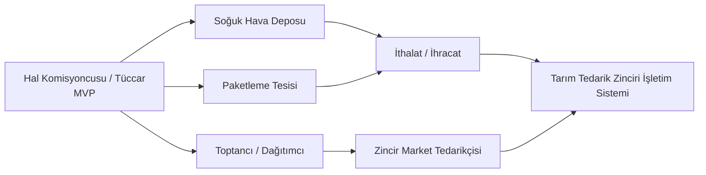

# 01 — Vizyon ve Ürün Stratejisi

> **Durum:** Taslak v0.1 · **Dil:** Türkçe
> **Önkoşul okuma:** [00-README](./00-README-Index.md)

---

## 1. Tek Cümlelik Vizyon

> **HalOS**, sebze-meyve hal komisyoncusunun/tüccarının tüm işini (satış, cari, müstahsil
> ödemesi, stok, yasal belge, soğuk zincir) tek yerden yöneten; **yapay zekânın işletmeyi
> aktif olarak yönettiği**, offline çalışabilen, yasal olarak %100 uyumlu bir
> **Tarım Tedarik Zinciri İşletim Sistemi**dir.

Piyasadaki mevcut hal programları "veri girme aracı"dır. HalOS'un farkı: **veriyi girmekle
kalmaz, veriyi yorumlar, uyarır ve önerir.**

---

## 2. Problem

Sebze-meyve hali, Türkiye'de milyarlarca liralık günlük ciroya sahip ama **operasyonel ve
yasal olarak karmaşık** bir sektör:

| Problem | Bugünkü Durum |
|---------|---------------|
| **Yasal karmaşa** | HKS bildirimi, e-Fatura (HAL senaryosu), e-Müstahsil Makbuzu, hal rüsumu, zirai stopaj — hepsi elle veya kopuk programlarla takip ediliyor. Ceza riski yüksek. |
| **Hesap karmaşası** | Her satışta komisyon (%8'e kadar) + KDV + stopaj (%2) + bağ-kur (%1) + rüsum (%1/%2) hesaplanmalı. El hesabı hatalı ve yavaş. |
| **Cari kaos** | Yüzlerce müstahsil ve alıcının cari hesabı; kim ne kadar borçlu, kime 15 gün içinde ödeme yapılmalı — çoğu zaman deftere yazılıyor. |
| **Fire ve bozulma** | Ürün bozuluyor, kimse önceden uyarmıyor. |
| **Görünürlük yok** | Patron sahada; "bugün ne sattık, kim ödemedi, ne stokta kaldı" bilgisine anlık erişemiyor. |
| **İnternet kesintisi** | Halde internet kopunca satış duruyor — kabul edilemez. |

---

## 3. Çözüm ve Değer Önerisi

HalOS dört temel sütun üzerine kurulur:

1. **Yasal uyum otomatik** — Her satış otomatik olarak doğru kesintileri hesaplar, e-Fatura /
   e-Müstahsil Makbuzu üretir, HKS'e bildirir. Kullanıcı "yasal mıyım?" diye düşünmez.
2. **AI-first** — AI muhasebeci, satış analisti, fiyat danışmanı ve fire tahmincisi olarak
   arka planda çalışır. (bkz. gelecek doküman `08-AI`.)
3. **Offline-first** — İnternet olmasa da satış devam eder; bağlantı gelince buluta senkronize
   olur (bkz. 04 — Sync Engine).
4. **Tek işletim sistemi** — Satış, cari, stok, muhasebe, soğuk depo IoT, bildirim — hepsi
   entegre; kopuk program yığını değil.

---

## 4. Hedef Pazar ve Genişleme Vizyonu

### 4.1 Birincil Hedef (MVP)
- **Hal komisyoncusu** (kabzımal) — kendi adına, müstahsil hesabına satış yapan, komisyon geliri elde eden.
- **Hal tüccarı** — kendi malını alıp satan.

Türkiye'de yüzlerce toptancı hali, on binlerce komisyoncu/tüccar işletmesi.

### 4.2 Genişleme (aynı altyapıyla)

Mimari bu genişlemeyi baştan destekleyecek şekilde kurulur (bkz. 04 — multi-tenant, modüler
bounded context'ler). Bugün bir hal yazılımı; yarın tüm tarım tedarik zincirinin OS'i.

---

## 5. Rakip Analizi

| Rakip Tipi | Güçlü Yön | Zaaf (HalOS fırsatı) |
|------------|-----------|----------------------|
| Yerel hal programları (masaüstü, eski) | Sektörü biliyor, ucuz | Bulut yok, mobil yok, AI yok, kötü UX, offline-sync yok |
| Genel ön muhasebe (Logo, Mikro vb.) | Muhasebe olgun | Hale özel değil (künye, HKS, komisyon modeli yok), AI yok |
| Excel + WhatsApp | Sıfır maliyet, esnek | Hata, yasal risk, görünürlük yok, ölçeklenmez |
| Yeni SaaS denemeleri | Modern UI | Yasal derinlik zayıf, AI yüzeysel, offline yok |

**HalOS konumlandırması:** *Hale özel derin yasal uyum + AI + offline + modern UX* birleşimini
tek üründe sunan ilk oyuncu.

---

## 6. Gelir Modeli

### 6.1 Abonelik (SaaS)

| Plan | Hedef | Notlar |
|------|-------|--------|
| **Deneme (Trial)** | 14-30 gün, tam özellik | Kredi kartısız başlangıç |
| **Aylık** | Küçük işletme | Kullanıcı/işlem bazlı kademeli |
| **Yıllık** | %2 indirimli taahhüt | Nakit akışı avantajı |
| **Lifetime** | Erken benimseyenler | Sınırlı kontenjan, pazarlama aracı |

Fiyatlandırma boyutları: tenant başına kullanıcı sayısı, aylık işlem/bildirim adedi, aktif
modüller (IoT, AI Agent, çoklu şube).

### 6.2 Marketplace (ileride)
Entegrasyon eklentileri gelir kalemi olur: Logo/Mikro muhasebe köprüsü, kargo, banka POS,
e-Defter aracı, IoT sensör paketleri. (bkz. Faz 4 — 06.)

### 6.3 AI Katmanı (premium)
AI Agent'lar (proaktif ödeme takibi, fiyat önerisi, fire tahmini, WhatsApp sipariş asistanı)
üst pakette veya kullanım bazlı ek gelir.

---

## 7. Kuzey Yıldızı ve Başarı Metrikleri

**Kuzey Yıldızı:** *Aktif tenant başına, HalOS üzerinden yasal olarak tamamlanan günlük satış
işlemi sayısı.* (Ürünün gerçekten işi yönettiğinin kanıtı.)

Destekleyici metrikler:
- Trial → ücretli dönüşüm oranı
- Aylık tekrarlayan gelir (MRR) ve net gelir kaybı (churn)
- Offline'da yapılıp başarıyla senkronlanan işlem oranı (güven metriği)
- HKS/GİB bildirim başarı oranı (yasal güven metriği)
- AI önerisi kabul oranı (AI değer metriği)

---

## 8. Üst Düzey Roadmap (özet — detay: 06)

| Faz | Odak | Sonuç |
|-----|------|-------|
| **Faz 0** | İskelet + altyapı | Çalışan multi-tenant iskelet, CI/CD, auth |
| **Faz 1 (MVP)** | Satış + Cari + Müstahsil Makbuzu + e-Fatura + HKS | Bir komisyoncu tüm günü HalOS'ta yönetebilir |
| **Faz 2** | Stok + Depo + Raporlar + AI temel | Görünürlük ve ilk AI değeri |
| **Faz 3** | Soğuk zincir IoT + WhatsApp AI + mobil patron | Farklılaştırıcı özellikler |
| **Faz 4** | Marketplace + entegrasyonlar + yeni dikeyler | Platform ve ölçek |

---

## 9. Kapsam Dışı (bu ürün ne DEĞİL?)

- Genel amaçlı ERP/muhasebe paketi değil (hale özel).
- Tüketiciye satış (B2C perakende POS) birincil hedef değil.
- Tarımsal üretim/çiftlik yönetim yazılımı değil (müstahsil tarafı değil, hal tarafı).

> Bu sınırlar, ürünün odağını korur. Genişleme (bölüm 4.2) **aynı domain mantığının** yeni
> işletme tiplerine taşınmasıdır — yeni bir ürün icat etmek değil.
