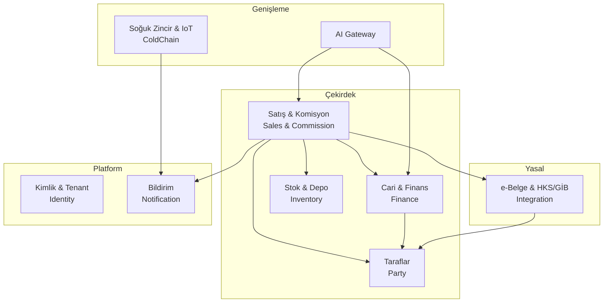
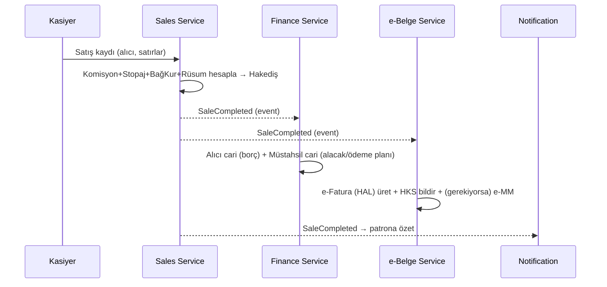
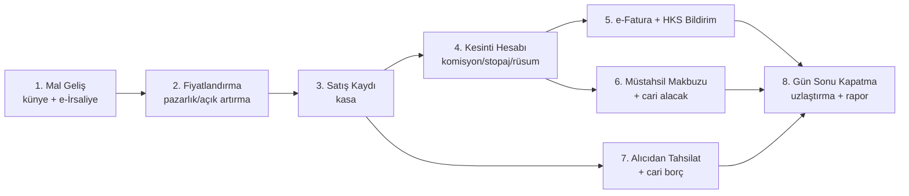

# 02 — Domain Model ve Ortak Sözlük (Ubiquitous Language)

> **Durum:** Taslak v0.1 · **Dil:** Türkçe · **EN KRİTİK DOKÜMAN**
> **Kural:** Bu dokümandaki terimler projenin **ortak dilidir**. Kod, tablo, API, ekran ve
> konuşma — hepsi **aynı** terimleri kullanır. Yeni terim uydurmak yasaktır (bkz. 07).

Bu doküman [Alan Odaklı Tasarım / Domain Driven Design (DDD)] yaklaşımıyla yazılmıştır.
Tüm terimler **gerçek Türk hal mevzuatı ve sektör uygulamasına** dayanır (5957 sayılı Kanun,
HKS, GİB e-Belge, VUK).

---

## 1. Ortak Sözlük (Ubiquitous Language)

> Kod tarafında sınıf/tablo adları için verilen İngilizce karşılıklar **bağlayıcıdır**.

### 1.1 Aktörler (Taraflar)

| Türkçe Terim | Kod Adı | Tanım | Yasal Statü |
|--------------|---------|-------|-------------|
| **Müstahsil** | `Producer` | Sebze-meyve üreticisi (çiftçi). Halde **yalnızca kendi ürettiğini** satabilir. | 5957 |
| **Üretici Örgütü** | `ProducerOrganization` | Sertifikalı üretici birliği; üyelerinin ve bölge üreticilerinin ürününü satabilir. | 5957 |
| **Komisyoncu (Kabzımal)** | `Broker` | Kendi adına, **müvekkil (müstahsil/tüccar) hesabına** satışa aracılık eden; **komisyon** geliri elde eden meslek mensubu. | 5957 — kayıtlı |
| **Tüccar** | `Merchant` | **Kendi adına ve hesabına** mal alıp satan; gelir kaynağı alım-satım marjı. | 5957 — kayıtlı |
| **Taşıyıcı (Sevkiyatçı)** | `Consignor` | Malı başka haldeki komisyoncuya gönderip sattıran ara aktör. | 5957 |
| **Alıcı (Perakendeci)** | `Buyer` | Malı toptan alıp tüketiciye satan (manav, market, lokanta vb.). | Müşteri |

> **Not:** "Kabzımal" halk dilinde **komisyoncu** ile eş anlamlıdır; kodda tek kavram `Broker`.
> `Producer`, `Merchant`, `Buyer` vb. hepsi tek bir `Party` (Taraf/Cari) kök kavramının
> rolleridir — bkz. bölüm 3 ve 05.

### 1.2 Belgeler

| Türkçe Terim | Kod Adı | Tanım | Yasal Statü |
|--------------|---------|-------|-------------|
| **Sevk İrsaliyesi / Manifesto** | `DispatchNote` | Malın gönderildiğini gösteren belge. Elektronik hali **e-İrsaliye** — zorunlu. | Zorunlu (e-İrsaliye) |
| **Künye** | `ProductPassport` | HKS'in satış sonrası ürettiği ürün pasaportu (19 haneli kod: üretim yeri, tür, miktar, üretici, sertifika). QR ile sorgulanır. | Zorunlu (HKS) |
| **Müstahsil Makbuzu** | `ProducerReceipt` | Kayıt tutmayan müstahsilden alımda düzenlenen belge; stopaj/kesinti içerir. Elektronik hali **e-Müstahsil Makbuzu (e-MM)**. | Zorunlu (VUK) |
| **e-Fatura (HAL)** | `Invoice` | Alıcıya kesilen fatura; senaryo = **HAL**, tür = **KOMİSYON** veya **SATIŞ**. | Zorunlu (GİB) |
| **HKS Bildirimi** | `HksNotification` | Alım-satım/aracılık faaliyetinin HKS'e raporu. | Zorunlu (HKS) |
| **Hal Rüsumu Belgesi** | `MarketFeeRecord` | Belediyeye ödenecek rüsumun tasdiki. | Zorunlu |

### 1.3 Finansal Kavramlar

| Türkçe Terim | Kod Adı | Tanım | Değer/Kural |
|--------------|---------|-------|-------------|
| **Komisyon** | `Commission` | Komisyoncunun satış bedeli üzerinden aldığı ücret. | **Maks %8** + KDV |
| **Zirai Stopaj** | `AgriculturalWithholding` | Müstahsilden yapılan gelir vergisi kesintisi. | **%2** (tipik) |
| **Çiftçi Bağ-Kur Primi** | `FarmerSocialSecurity` | Müstahsilden kesilen SGK primi. | **%1** (tipik) |
| **Hal Rüsumu** | `MarketFee` | Belediyeye ödenen pazar rüsumu. | Hal içi **%1**, hal dışı **%2** |
| **KDV** | `Vat` | Katma değer vergisi (komisyon ve mal üzerinde). | Ürün/işleme göre oran |
| **Cari Hesap** | `CurrentAccount` | Bir tarafın (müstahsil/alıcı) borç-alacak defteri. | — |
| **Avans** | `Advance` | Teslimat/satış öncesi verilen peşin ödeme. | Mahsuplaşır |
| **Tahsilat** | `Collection` | Alacağın (alıcıdan) tahsil edilmesi. | 7.000 TL üstü banka zorunlu |
| **Ödeme** | `Payment` | Müstahsile yapılan ödeme. | **15 iş günü** kuralı |
| **Hakediş** | `Settlement` | Kesintiler sonrası müstahsile ödenecek net tutar. | Hesaplanır |
| **Fire** | `Spoilage` | Taşıma/depolama/temizlikte oluşan kayıp. | Ürün bazlı % |

### 1.4 Operasyonel Kavramlar

| Türkçe Terim | Kod Adı | Tanım |
|--------------|---------|-------|
| **Mal Geliş** | `Consignment` | Müstahsil/tüccardan gelen mal partisinin kabulü (künye + irsaliye ile). |
| **Kasa (birim)** | `Crate` | Standart taşıma/sunum birimi (~5-20 kg). |
| **Satış Kaydı** | `SaleTransaction` | Bir alıcıya yapılan tek satış işlemi (bir/çok satır). |
| **Satış Satırı** | `SaleLine` | Satıştaki tek ürün kalemi (ürün, miktar, birim, fiyat). |
| **Ölçü Birimi** | `UnitOfMeasure` | Kasa / Kg / Çuval / Adet / Sandık. |
| **Gün Sonu** | `DayEndClose` | Günlük mali kapatma, uzlaştırma ve raporlama. |
| **Fiyat** | `Price` | Günlük, arz-talep ile belirlenen fiyat (pazarlık veya açık artırma). |

---

## 2. Bounded Context'ler (Sınırlı Bağlamlar)

Sistem, birbirinden net sınırlarla ayrılmış bağlamlara bölünür. Her bağlam kendi
mikroservisine karşılık gelir (bkz. 04).

| Bağlam | Sorumluluk | Sahiplendiği Ana Kavramlar |
|--------|------------|----------------------------|
| **Satış & Komisyon** | Mal geliş, satış, komisyon/kesinti hesabı | `Consignment`, `SaleTransaction`, `Commission`, `Settlement` |
| **Cari & Finans** | Cari hesaplar, ödeme, tahsilat, avans | `CurrentAccount`, `Payment`, `Collection`, `Advance` |
| **Taraflar** | Müstahsil/alıcı/tüccar kayıtları, kimlik/vergi | `Party` (Producer/Buyer/Merchant rolleri) |
| **Stok & Depo** | Depo, stok hareketi, fire | `Warehouse`, `StockItem`, `Spoilage` |
| **e-Belge & Yasal Entegrasyon** | HKS bildirim, e-Fatura, e-MM, künye, rüsum | `HksNotification`, `Invoice`, `ProducerReceipt`, `ProductPassport` |
| **Soğuk Zincir & IoT** | Soğuk oda, sensör, sıcaklık, alarm | `ColdRoom`, `Sensor`, `TemperatureReading` |
| **AI Gateway** | Doğal dil sorgu, öneri, tahmin (ayrı Python servisi) | `AIConversation` (okuma modeli) |
| **Kimlik & Tenant** | İşletme (tenant), kullanıcı, rol, lisans | `Tenant`, `User`, `Role`, `Subscription` |
| **Bildirim** | Push/SMS/e-posta/in-app bildirim | `Notification` |

> **Context Mapping:** Satış & Komisyon çekirdektir; diğerleri onu **domain event**'lerle
> dinler (örn. `SaleCompleted` → Finans cariyi günceller, e-Belge fatura üretir, Bildirim
> patrona haber verir). Senkron bağımlılık minimumda tutulur.

---

## 3. Ana Aggregate'ler (Kümeler)

Aggregate = tutarlılık sınırı; tek transaction'da bütün olarak değişen kavram kümesi.

### 3.1 `Party` (Taraf / Cari) — *Taraflar bağlamı*
- Kök: `Party` (kimlik: ad, TCKN/VKN, vergi dairesi, adres, telefon)
- Roller: `Producer`, `Buyer`, `Merchant`, `Consignor` (bir taraf birden çok rol taşıyabilir)
- Değişmezler: TCKN/VKN tenant içinde tekil; müstahsilin stopaj profili tanımlı olmalı.

### 3.2 `Consignment` (Mal Geliş) — *Satış & Komisyon*
- Kök: `Consignment` (hangi müstahsil/tüccardan, tarih, künye, sevk irsaliyesi referansı)
- İçerir: gelen kalemler (ürün, miktar, birim), atanan künye.
- Event: `ConsignmentReceived`.

### 3.3 `SaleTransaction` (Satış Kaydı) — *Satış & Komisyon* — **çekirdek aggregate**
- Kök: `SaleTransaction` (alıcı, tarih, kaynak `Consignment`(ler))
- İçerir: `SaleLine`'lar (ürün, miktar, birim, birim fiyat, tutar)
- Hesaplama sonucu: `CommissionCalculation` + `Deduction`'lar (komisyon, stopaj, bağ-kur, rüsum, KDV) → `Settlement` (müstahsile net)
- Değişmez: `Σ SaleLine.tutar = brüt satış`; kesintiler brüt üzerinden hesaplanır; `Settlement.net = brüt − (komisyon + stopaj + bağkur + rüsum)`.
- Event: `SaleCompleted`.

### 3.4 `CurrentAccount` (Cari Hesap) — *Cari & Finans*
- Kök: `CurrentAccount` (bir `Party`'ye bağlı), hareketler: borç/alacak, avans, ödeme, tahsilat
- Değişmez: bakiye = Σ hareketler; müstahsile ödeme **15 iş günü** içinde planlanır.
- Event: `PaymentDue`, `PaymentMade`, `CollectionReceived`.

### 3.5 `LegalDocument` (Yasal Belge) — *e-Belge & Entegrasyon*
- Alt tipler: `Invoice` (e-Fatura HAL), `ProducerReceipt` (e-MM), `ProductPassport` (künye), `HksNotification`, `MarketFeeRecord`
- Değişmez: her başarılı satış → en az bir e-Fatura + HKS bildirimi + (müstahsil kayıt tutmuyorsa) e-MM üretir.
- Event: `DocumentIssued`, `HksNotified`, `DocumentRejected`.

### 3.6 `ColdRoom` (Soğuk Oda) — *Soğuk Zincir & IoT*
- Kök: `ColdRoom`, içerir `Sensor`'lar; `TemperatureReading` zaman serisi.
- Event: `TemperatureThresholdBreached`.

---

## 4. Çekirdek İş Kuralı: Satış → Kesinti → Hakediş

Bu, sistemin kalbidir. Örnek (100 TL brüt satış, hal içi):

| Kalem | Kod | Oran | Tutar |
|-------|-----|------|-------|
| Brüt Satış Bedeli | `gross` | — | **100,00 TL** |
| (−) Komisyon | `commission` | %8 | 8,00 TL |
| (−) Zirai Stopaj | `agriWithholding` | %2 | 2,00 TL |
| (−) Çiftçi Bağ-Kur | `farmerSSK` | %1 | 1,00 TL |
| (−) Hal Rüsumu | `marketFee` | %1 | 1,00 TL |
| **= Müstahsile Net (Hakediş)** | `settlement.net` | — | **88,00 TL** |

Ayrıca:
- Komisyon üzerine **KDV** hesaplanır (komisyoncunun geliri).
- Oranlar **tenant + tarih + taraf** bazında yapılandırılabilir (mevzuat değişir; komisyon
  taraflar arası serbest, maks %8).
- Tüm para alanları **`decimal`** (asla float) ve yuvarlama kuralı belgelenir (bkz. 07).

---

## 5. Operasyonel Akış (Günlük)

**Ödeme/tahsilat zamanlaması (yasal):**
- Müstahsile ödeme: normal satışta **15 iş günü**, vadeli satışta **30 gün** içinde.
- Hal rüsumu belediyeye: **5 iş günü** içinde (alıcı + komisyoncu ortak sorumlu).
- 7.000 TL üstü tahsilat/ödeme: **banka/finansal kuruluş** üzerinden ve belgeli.

---

## 6. Domain Event Kataloğu (özet)

| Event | Yayan Bağlam | Dinleyen(ler) |
|-------|--------------|---------------|
| `ConsignmentReceived` | Satış | Stok, e-Belge (künye) |
| `SaleCompleted` | Satış | Finans, e-Belge, Bildirim, Stok, AI |
| `SettlementCalculated` | Satış | Finans, e-Belge (e-MM) |
| `InvoiceIssued` / `HksNotified` | e-Belge | Satış (durum), Bildirim |
| `DocumentRejected` | e-Belge | Bildirim (uyarı), Satış |
| `PaymentDue` | Finans | Bildirim, AI (proaktif hatırlatma) |
| `CollectionReceived` / `PaymentMade` | Finans | Cari güncelleme, Bildirim |
| `TemperatureThresholdBreached` | Soğuk Zincir | Bildirim, AI (fire tahmini) |
| `SpoilageRecorded` | Stok | Finans, AI |

> Event isimleri kodda **birebir** kullanılır (İngilizce, PascalCase). Yeni event eklenirken
> bu tabloya eklenir.

---

## 7. Terminoloji Anti-Pattern'leri (YAPMA)

- ❌ "customer" gibi jenerik terim kullanma → `Buyer`/`Producer`/`Party` (rol nettir).
- ❌ Komisyon ve rüsumu tek "fee" altında birleştirme → yasal olarak ayrı, ayrı sakla.
- ❌ Para için `float`/`double` → **`decimal`** (07'de zorunlu kural).
- ❌ "receipt" ile e-Fatura'yı karıştırma → `ProducerReceipt` (müstahsile) ≠ `Invoice` (alıcıya).
- ❌ Künye'yi barkod/SKU ile karıştırma → `ProductPassport` yasal HKS kimliğidir.
