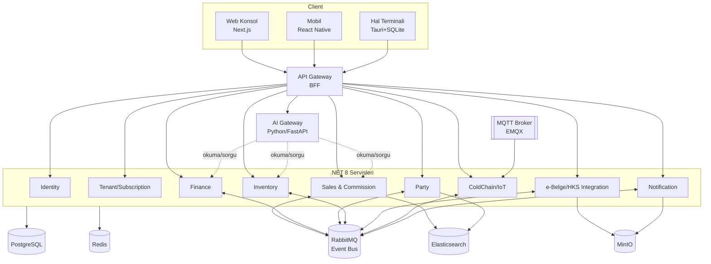
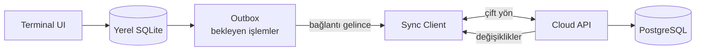
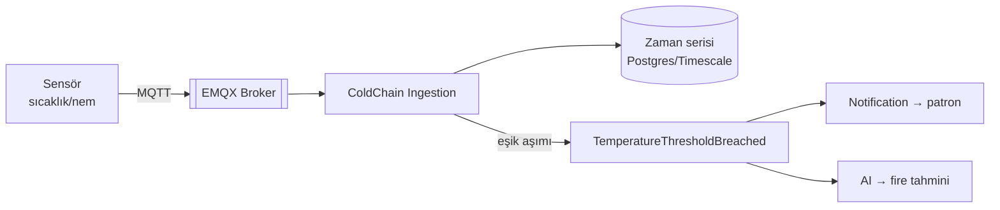

# 04 — Sistem Mimarisi ve Mimari Kararlar (ADR)

> **Durum:** Taslak v0.1 · **Dil:** Türkçe
> **Karar felsefesi:** Tam enterprise mimari **gün-1'de** tasarlanır; teslim **fazlıdır** (06).
> Bir geliştirici bu dokümanı okuyarak mimari bir karar vermek zorunda kalmamalıdır.

---

## 1. Mimari İlkeler

1. **Domain merkezli** — İş kuralları altyapıdan bağımsız (Clean Architecture).
2. **Bounded context = servis** — 02'deki bağlamlar mikroservislere karşılık gelir.
3. **Event-driven** — Bağlamlar birbirini domain event'lerle dinler; senkron bağ minimumda.
4. **Offline-first** — Hal terminali internetsiz çalışır, sonra senkronize olur.
5. **Multi-tenant baştan** — Her veri `tenant_id` ile izole (BK-8).
6. **Yasal uyum çekirdekte** — e-Belge/HKS opsiyonel eklenti değil, birinci sınıf.
7. **AI dışarıda** — AI hiçbir zaman domain'e gömülü değil; ayrı servis (kullanıcı şartı).

---

## 2. Mimari Kararlar (ADR'ler)

> Format: her karar bağlam + karar + gerekçe + sonuç. Karar değişirse **yeni ADR** eklenir,
> eski "Superseded" işaretlenir (silinmez).

### ADR-001 — Çekirdek Backend: C# / .NET 8
- **Bağlam:** Para-yoğun (komisyon/stopaj/rüsum), uzun ömürlü, karmaşık domainli enterprise ERP.
- **Karar:** Çekirdek domain servisleri **C# / .NET 8 (LTS)**; Clean Architecture + DDD + CQRS (MediatR) + EF Core + FluentValidation.
- **Gerekçe:** `decimal` ile güvenli para matematiği; olgun enterprise ekosistem; büyük kod tabanında sürdürülebilirlik; MediatR/Hangfire/SignalR birinci sınıf. İnsan ekip yetkinliği kısıt değil (AI geliştirecek) → objektif en iyi araç seçildi.
- **Sonuç:** Statik tip güvenliği + performans; öğrenme eğrisi AI tarafından üstlenilir.
- **Alternatif (reddedildi):** NestJS (TS full-stack) — geçerli, ama finansal domainde .NET olgunluğu öne çıktı. *Geri alınırsa tek değişim noktası budur.*

### ADR-002 — AI Ayrı Servis: Python / FastAPI
- **Karar:** Tüm AI/LLM işleri **ayrı Python/FastAPI servisi**; birincil model **Anthropic Claude**.
- **Gerekçe:** En zengin LLM/ML ekosistemi; domain'i kirletmez; bağımsız ölçeklenir/dağıtılır. Kullanıcının mevcut FastAPI pattern'i.
- **Sonuç:** ERP ↔ AI Gateway ↔ LLM üç katmanlı sınır (02, §Genişleme).

### ADR-003 — Web: Next.js / React / TypeScript
- **Karar:** Yönetim konsolu **Next.js + React + TS**.
- **Gerekçe:** En güçlü web frontend; masaüstü ve mobil ile bileşen/tip paylaşımı.

### ADR-004 — Mobil: React Native / Expo
- **Karar:** Patron mobil uygulaması **React Native / Expo** (Flutter değil).
- **Gerekçe:** Web (React) ile ekosistem/tip/bileşen paylaşımı → dil çeşitliliğini azaltır. Patron uygulaması (grafik/bildirim/sesli) için RN fazlasıyla yeterli.

### ADR-005 — Masaüstü: Tauri + React + SQLite
- **Karar:** Hal terminali (offline-first) **Tauri + React + yerel SQLite**.
- **Gerekçe:** Native his + düşük RAM (Avalonia'nın kazanımı) AMA React UI'ı web ile paylaşır (Electron'dan hafif).

### ADR-006 — Mimari Stil: Modüler Mikroservis + Event Bus
- **Karar:** Bağlam başına servis; **RabbitMQ** ile asenkron event; senkron çağrılar minimum.
- **Gerekçe:** Bağımsız ölçek/dağıtım; hedef ölçek (10k işletme, 80k kullanıcı). Faz 0'da servisler tek repo (monorepo) + tek deploy ile başlar, gerçek yük geldikçe ayrışır (evrimsel).

### ADR-007 — Veri: PostgreSQL + Redis + Elasticsearch + SQLite
- **Karar:** Birincil OLTP **PostgreSQL**; cache/kilit/kuyruk yardımı **Redis**; arama **Elasticsearch**; offline yerel **SQLite**; dosya **MinIO/Blob**.
- **Gerekçe:** Postgres güçlü ilişkisel + JSONB; ES "Ali'nin her şeyi 1 saniyede" araması; SQLite offline; MinIO belge/görsel.

### ADR-008 — Multi-Tenancy: Row-Level (`tenant_id`), sonra schema-per-tenant
- **Karar:** Başlangıçta paylaşımlı şema + zorunlu `tenant_id` filtresi (global query filter); büyük tenant'lar için ileride schema/db ayrımı.
- **Gerekçe:** Basit başla, gerçek ihtiyaçta izole et.

### ADR-009 — Kimlik: JWT + Refresh + 2FA, merkezi Identity servisi
- **Karar:** Merkezi **Identity** servisi; kısa ömürlü JWT + refresh token; 2FA (TOTP); RBAC.
- **Gerekçe:** Standart, güvenli, servisler arası taşınabilir. (Keycloak/Duende değerlendirilebilir.)

### ADR-010 — e-Belge/HKS Entegrasyonu: Ayrı Integration servisi
- **Karar:** HKS web servisleri + GİB e-Fatura/e-İrsaliye/e-MM/e-Defter tek **Integration** servisinde; dış çağrılar retry + outbox pattern ile.
- **Gerekçe:** Yasal entegrasyon değişken ve kırılgan; izole edilir, kuyruklanır, tekrar denenir.

---

## 3. Mikroservis Haritası



| Servis | Sorumluluk | Bağlam (02) |
|--------|------------|-------------|
| **Identity** | Kullanıcı, kimlik doğrulama, JWT/2FA, RBAC | Kimlik |
| **Tenant/Subscription** | İşletme, lisans, plan, kullanım limitleri | Kimlik |
| **Sales & Commission** | Mal geliş, satış, kesinti/hakediş | Satış & Komisyon |
| **Finance** | Cari, ödeme, tahsilat, avans | Cari & Finans |
| **Party** | Müstahsil/alıcı/tüccar kartları | Taraflar |
| **Inventory** | Stok, depo, fire | Stok & Depo |
| **Integration (e-Belge/HKS)** | e-Fatura, e-MM, künye, HKS bildirim, rüsum | e-Belge |
| **ColdChain/IoT** | Soğuk oda, sensör, sıcaklık, alarm | Soğuk Zincir |
| **Notification** | Push/SMS/e-posta/in-app | Bildirim |
| **AI Gateway (Python)** | Doğal dil sorgu, öneri, tahmin | AI |

---

## 4. Servis İç Yapısı (Clean Architecture)

Her .NET servisi **aynı** dört katmanlı yapıyı kullanır (07'de zorunlu):

```
ServiceName/
├── Domain/           # Entity, Value Object, Aggregate, Domain Event, arayüzler (bağımlılık YOK)
├── Application/      # Use case'ler: CQRS Command/Query + Handler (MediatR), FluentValidation
├── Infrastructure/   # EF Core, repository impl., dış servis, mesajlaşma, cache
└── Api/              # Controller/Minimal API, DI, config, middleware
```

Bağımlılık yönü: `Api → Application → Domain`, `Infrastructure → Application/Domain`.
Domain hiçbir dış katmana bağımlı değildir.

---

## 5. Offline-First Sync Engine

Hal terminali (Tauri) internetsiz çalışır.



**Tasarım kuralları:**
- Her işlem **idempotent** (client-generated `operationId` / UUID) — çift senkron güvenli.
- Yazma modeli **outbox**: yerelde commit → kuyruğa al → online olunca gönder.
- **Çakışma çözümü:** mali kayıtlar **append-only** (silme yok, ters kayıt) → çakışma nadir;
  master veri (ürün/oran) için **son-yazan-kazanır + versiyon damgası**; belirsizlikte
  kullanıcıya sor.
- **Sıra garantisi:** aynı aggregate'in işlemleri sıralı gönderilir (per-aggregate kuyruk).
- e-Belge/HKS gibi **online zorunlu** işlemler offline'da "beklemede" kuyruğa girer,
  bağlantıda otomatik gönderilir; kullanıcı durumu görür.

---

## 6. IoT / Soğuk Zincir Akışı (Faz 3)



- Protokol: **MQTT** (EMQX); cihaz kimliği tenant'a bağlı.
- Eşik aşımında domain event → anlık bildirim + AI fire tahmini.

---

## 7. Güvenlik Mimarisi

| Konu | Yaklaşım |
|------|----------|
| Kimlik | JWT (kısa ömür) + refresh token; TOTP tabanlı 2FA |
| Yetki | RBAC (03 §3 matrisi); en az yetki ilkesi |
| Tenant izolasyonu | Zorunlu `tenant_id` global query filter; token'da tenant claim |
| Taşıma | Her yerde TLS; iç servisler mTLS (K8s) |
| Sırlar | Vault/Key Vault; kaynak koda sır yazılmaz |
| Denetim | Mali işlemler audit log (kim/ne/ne zaman); değiştirilemez |
| Dış entegrasyon | e-Belge/HKS kimlikleri şifreli saklanır; erişim loglanır |
| Veri | Hassas alanlar (TCKN/VKN) şifreli; yedekleme + geri yükleme planı |

---

## 8. Gözlemlenebilirlik (Observability)

| Katman | Araç |
|--------|------|
| Log | **Serilog** → **Seq** (dev) / **Loki** (prod) |
| Metrik | **Prometheus** → **Grafana** |
| İz (trace) | **OpenTelemetry** (servisler arası dağıtık iz) |
| Uyarı | Grafana Alerting → Notification servisi / on-call |
| Sağlık | Her serviste `/health`, `/ready` uçları |

---

## 9. Dağıtım (Deployment)

- **Geliştirme:** `docker-compose` — tüm servisler + Postgres/Redis/ES/RabbitMQ/MinIO tek komutla.
- **Üretim:** **Kubernetes**; her servis ayrı deployment; yatay ölçek; RabbitMQ/Postgres yönetilen servis olabilir (Azure/AWS).
- **CI/CD:** her PR'da build + test + lint; main'e merge → image → registry → ortama deploy (06 Faz 0).
- **Yapılandırma:** ortam bazlı config + sırlar Vault'tan; migration deploy'da otomatik (kontrollü).

---

## 10. Arka Plan Görevleri ve Realtime

- **Hangfire** (.NET): 15 gün ödeme hatırlatma, gün sonu, HKS retry, rapor üretimi.
- **SignalR**: anlık bildirim, canlı dashboard, satış/tahsilat güncellemeleri.
- **Outbox pattern**: event yayınları veritabanı transaction'ı ile atomik (kayıp/çift yok).

---

## 11. Karar Değişikliği Nasıl Yapılır?

Bir mimari kararı değiştirmek isteyen kişi:
1. Bu dosyaya **yeni bir ADR** ekler (ADR-0xx), gerekçesiyle.
2. Etkilenen eski ADR'yi **"Superseded by ADR-0xx"** olarak işaretler (silmez).
3. Etkilenen diğer dokümanları (03/05/06/07) günceller.
4. Geliştirme, güncel doküman onaylanmadan başlamaz (07 direktifi).
