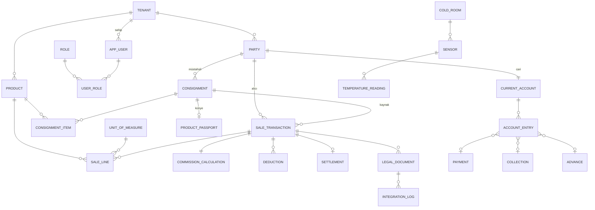

# 05 — Veritabanı Çekirdek Şema

> **Durum:** Taslak v0.1 · **Dil:** Türkçe
> **Önkoşul:** [02-Domain-Model](./02-Domain-Model-ve-Ortak-Sozluk.md), [04-Mimari](./04-Sistem-Mimarisi-ve-ADR.md)

Bu doküman **çekirdek** tabloları ve ilişkileri tanımlar (MVP + gün-1 mimarisi için gereken
iskelet). Her modülün detaylı alanları geliştirme sırasında genişletilir. Birincil veritabanı
**PostgreSQL**; her mikroservis kendi şemasına/veritabanına sahiptir (04 ADR-006/007).

---

## 1. Genel Kurallar (Bağlayıcı)

| Kural | Açıklama |
|-------|----------|
| **Çoklu kiracı** | Her iş tablosunda `tenant_id UUID NOT NULL`; global query filter zorunlu (BK-8). |
| **PK** | `id UUID` (v7/sıralı tercih); doğal anahtar değil. |
| **Para** | `NUMERIC(18,2)` (`decimal`) — **asla** float/real (BK-2). |
| **Oran** | `NUMERIC(7,4)` (örn. 0,0800 = %8). |
| **Zaman** | `timestamptz` (UTC saklanır); `created_at`, `updated_at` her tabloda. |
| **Denetim** | Mali tablolarda `created_by`, ek olarak `audit_log` (kim/ne/ne zaman). |
| **Soft-delete** | Mali kayıt **silinmez**; `is_cancelled` + ters kayıt (BK-9). Master veri için `is_active`. |
| **Enum** | Kod + referans tablo veya check constraint; anlam 02'deki sözlükten. |
| **İndeks** | `tenant_id` her sorguda; sık filtre alanlarına ve FK'lere indeks (§6). |

---

## 2. ER Diyagramı (Çekirdek)

---

## 3. Tablo Tanımları (Çekirdek)

### 3.1 Kimlik & Tenant (Identity / Tenant servisi)

**`tenant`** — İşletme (kiracı)
| Alan | Tip | Not |
|------|-----|-----|
| id | UUID PK | |
| name | text | İşletme adı |
| tax_number | text | VKN |
| market_type | text | komisyoncu / tüccar |
| is_active | bool | |
| created_at / updated_at | timestamptz | |

**`subscription`** — Lisans/plan
| id UUID PK · tenant_id FK · plan (trial/monthly/yearly/lifetime) · status · starts_at · ends_at · limits JSONB |

**`app_user`** — Kullanıcı
| id UUID PK · tenant_id FK · email · phone · password_hash · totp_secret (2FA) · is_active · created_at |

**`role`** — Rol (Patron/Yönetici/Muhasebe/Kasiyer/Depo — 03 §3)
| id UUID PK · tenant_id FK (veya sistem) · code · name |

**`user_role`** — Kullanıcı-rol eşlemesi
| user_id FK · role_id FK · (PK: user_id+role_id) |

*(İzinler MVP'de rol koduna gömülü; ileride `permission` + `role_permission` tablolarına açılır.)*

### 3.2 Taraflar (Party servisi)

**`party`** — Cari kart (Müstahsil/Alıcı/Tüccar/Taşıyıcı)
| Alan | Tip | Not |
|------|-----|-----|
| id | UUID PK | |
| tenant_id | UUID FK | |
| type | text | producer / buyer / merchant / consignor (çoklu rol → `party_role`) |
| display_name | text | |
| tckn | text | müstahsil (bireysel) |
| vkn | text | tüzel |
| tax_office | text | |
| phone / address | text | |
| keeps_records | bool | müstahsil kayıt tutuyor mu (e-MM gerekliliği — BK-4) |
| withholding_profile | JSONB | stopaj/bağ-kur oranları (varsayılan override) |
| is_active | bool | |

> Kısıt: `(tenant_id, tckn)` ve `(tenant_id, vkn)` tekil (dolu olanlar).

### 3.3 Ürün & Birim (Inventory servisi)

**`product`** — Ürün kataloğu
| id · tenant_id · name · category · default_unit_id FK · is_active |

**`unit_of_measure`** — Ölçü birimi
| id · tenant_id · code (crate/kg/sack/piece/box) · name · base_factor (kg dönüşümü, ops.) |

### 3.4 Mal Geliş (Sales servisi)

**`consignment`** — Mal geliş partisi
| id · tenant_id · producer_party_id FK · received_at · dispatch_note_ref (e-İrsaliye) · status · created_by |

**`consignment_item`** — Gelen kalem
| id · consignment_id FK · product_id FK · quantity NUMERIC(18,3) · unit_id FK |

### 3.5 Satış & Kesinti (Sales servisi) — **çekirdek**

**`sale_transaction`** — Satış kaydı
| Alan | Tip | Not |
|------|-----|-----|
| id | UUID PK | |
| tenant_id | UUID FK | |
| buyer_party_id | UUID FK | alıcı |
| consignment_id | UUID FK | kaynak mal (nullable — tüccar kendi malı) |
| sold_at | timestamptz | |
| gross_amount | NUMERIC(18,2) | Σ sale_line (BK-1) |
| is_within_market | bool | hal içi/dışı → rüsum oranı (BK-5) |
| status | text | draft / completed / cancelled |
| operation_id | UUID | offline idempotency (04 §5) |
| is_cancelled | bool | ters kayıt için (BK-9) |
| created_by | UUID | |

**`sale_line`** — Satış satırı
| id · sale_transaction_id FK · product_id FK · quantity NUMERIC(18,3) · unit_id FK · unit_price NUMERIC(18,2) · line_amount NUMERIC(18,2) |

**`commission_calculation`** — Komisyon hesabı (1:1 satış)
| id · sale_transaction_id FK · commission_rate NUMERIC(7,4) · commission_amount · vat_rate · vat_amount |

**`deduction`** — Kesintiler (1:N satış) — komisyon dışı kalemler ayrı satır
| id · sale_transaction_id FK · type (commission/agri_withholding/farmer_ssk/market_fee/vat) · rate NUMERIC(7,4) · amount NUMERIC(18,2) |

**`settlement`** — Müstahsile hakediş (1:1 satış)
| id · sale_transaction_id FK · net_amount NUMERIC(18,2) · due_date date (15 iş günü — BK-3) · status (pending/scheduled/paid) |

> **Değişmez:** `settlement.net_amount = gross_amount − Σ deduction(commission, agri_withholding, farmer_ssk, market_fee)`.

### 3.6 e-Belge & Entegrasyon (Integration servisi)

**`legal_document`** — Yasal belge (çok tipli)
| Alan | Tip | Not |
|------|-----|-----|
| id | UUID PK | |
| tenant_id | UUID FK | |
| doc_type | text | invoice / producer_receipt / product_passport / hks_notification / market_fee |
| sale_transaction_id | UUID FK | ilgili satış (nullable) |
| party_id | UUID FK | ilgili taraf |
| external_ref | text | GİB/HKS numarası, künye kodu (19 hane) |
| scenario | text | e-Fatura: HAL; belge türü: KOMİSYON/SATIŞ |
| status | text | pending / sent / accepted / rejected |
| payload | JSONB | gönderilen içerik |
| issued_at | timestamptz | |

**`integration_log`** — Dış çağrı kaydı (retry/outbox)
| id · tenant_id · document_id FK · target (hks/gib/belediye) · request JSONB · response JSONB · attempt · status · created_at |

### 3.7 Cari & Finans (Finance servisi)

**`current_account`** — Cari hesap (1:1 party)
| id · tenant_id · party_id FK · balance NUMERIC(18,2) (türetilmiş/cache) |

**`account_entry`** — Cari hareket (append-only)
| Alan | Tip | Not |
|------|-----|-----|
| id | UUID PK | |
| tenant_id | UUID FK | |
| current_account_id | UUID FK | |
| direction | text | debit (borç) / credit (alacak) |
| amount | NUMERIC(18,2) | |
| entry_type | text | sale / settlement / payment / collection / advance / adjustment |
| ref_id | UUID | ilgili satış/ödeme/tahsilat |
| occurred_at | timestamptz | |

**`payment`** — Müstahsile ödeme · **`collection`** — Alıcıdan tahsilat · **`advance`** — Avans
| ortak: id · tenant_id · party_id FK · amount NUMERIC(18,2) · channel (cash/bank) · bank_ref · occurred_at |
> Kısıt: `channel='cash' AND amount > 7000` yasak (BK-6).

### 3.8 Stok & Fire (Inventory servisi)

**`stock_item`** — Stok durumu (ürün+birim bazında)
| id · tenant_id · product_id FK · unit_id FK · quantity_on_hand NUMERIC(18,3) |

**`stock_movement`** — Stok hareketi
| id · tenant_id · product_id · direction (in/out/spoilage) · quantity · ref_id (consignment/sale) · occurred_at |

**`spoilage`** — Fire kaydı
| id · tenant_id · product_id · quantity · reason · occurred_at |

### 3.9 Soğuk Zincir & IoT (ColdChain servisi — Faz 3)

**`cold_room`** | id · tenant_id · name · target_temp_min · target_temp_max |
**`sensor`** | id · tenant_id · cold_room_id FK · device_id · type (temp/humidity) |
**`temperature_reading`** | id · tenant_id · sensor_id FK · value NUMERIC(6,2) · recorded_at (zaman serisi; Timescale/partition) |

### 3.10 Bildirim & AI

**`notification`** | id · tenant_id · user_id FK · type · title · body · channel (push/sms/email/in_app) · is_read · created_at |
**`ai_conversation`** | id · tenant_id · user_id FK · started_at · context JSONB · (mesajlar `ai_message`) — **okuma odaklı; AI servisi yazar** |

### 3.11 Denetim

**`audit_log`** | id · tenant_id · user_id · action · entity_type · entity_id · before JSONB · after JSONB · created_at |

---

## 4. Kritik İlişki ve Değişmezler Özeti

- Bir `sale_transaction` → çok `sale_line`; `gross_amount = Σ line_amount`.
- Bir `sale_transaction` → 1 `commission_calculation`, N `deduction`, 1 `settlement`.
- `settlement.net_amount` = kesintiler sonrası (BK-1); `due_date` = 15 iş günü (BK-3).
- Her tamamlanmış satış → ≥1 `legal_document` (invoice + hks_notification; gerekiyorsa producer_receipt) (BK-4).
- `account_entry` **append-only**; bakiye türetilir (04 §5 çakışma çözümü ile uyumlu).
- Nakit `payment/collection` 7.000 TL'yi aşamaz (BK-6).

---

## 5. Multi-Tenant ve Servis Sınırı Notu

- Her servis kendi şemasına sahip (04 ADR-006). Servisler arası referans **ID ile**, FK ile
  değil (örn. Finance, `party_id`'yi tutar ama Party tablosuna FK vermez).
- `tenant_id` her tabloda; EF Core **global query filter** ile otomatik uygulanır (07).
- Cross-service tutarlılık **event + eventual consistency** ile (04 §Event-driven), dağıtık
  transaction'dan kaçınılır (outbox/saga).

---

## 6. İndeks Stratejisi (Başlangıç)

| Tablo | İndeks |
|-------|--------|
| Tüm iş tabloları | `(tenant_id)` ve sık filtreler için `(tenant_id, <alan>)` bileşik |
| sale_transaction | `(tenant_id, sold_at)`, `(tenant_id, buyer_party_id)`, `(tenant_id, status)` |
| account_entry | `(tenant_id, current_account_id, occurred_at)` |
| legal_document | `(tenant_id, doc_type, status)`, `(external_ref)` |
| settlement | `(tenant_id, status, due_date)` — 15 gün hatırlatma sorgusu |
| temperature_reading | `(sensor_id, recorded_at)` — zaman serisi (partition/Timescale) |
| party | `(tenant_id, tckn)`, `(tenant_id, vkn)` tekil |

> **Arama (Elasticsearch):** `party`, `sale_transaction`, `legal_document` için okuma modeli
> ES'e indekslenir ("Ali'nin faturaları/siparişleri/tahsilatı 1 saniyede" — 01/04). Postgres
> kaynak-of-truth; ES event ile beslenir.
