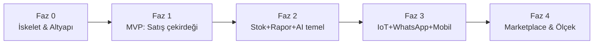

# 06 — Yol Haritası ve Faz Planı

> **Durum:** Taslak v0.1 · **Dil:** Türkçe
> **İlke:** Enterprise mimari **gün-1'de** kurulur; **teslim fazlıdır**. Tam mimariyi
> dokümante etmek ≠ her şeyi aynı anda kodlamak. Her faz **çalışan, satılabilir** bir artıştır.

---

## 1. Faz Özeti

| Faz | Hedef | "Bitti" Kriteri |
|-----|-------|-----------------|
| **0** | İskelet + altyapı | Multi-tenant iskelet ayakta, CI/CD yeşil, login+2FA çalışıyor |
| **1 (MVP)** | Satış çekirdeği + yasal | Bir komisyoncu tüm günü HalOS'ta yasal yönetebiliyor (03 §1) |
| **2** | Görünürlük + ilk AI | Stok, gün sonu raporları, AI sorgu (muhasebeci/satış) |
| **3** | Farklılaştırıcılar | Soğuk zincir IoT, WhatsApp sipariş, mobil patron app, offline saha |
| **4** | Platform & ölçek | Marketplace, dış entegrasyonlar, çoklu şube, yeni dikeyler |

> Sprint uzunluğu ve tarih **tahmini değil**; ekip hızına göre 06 güncellenir. Aşağıdaki
> "sprint iskeleti" **iş sıralamasıdır**, süre taahhüdü değil.

---

## 2. Faz 0 — İskelet & Altyapı

**Amaç:** Tüm mimari kararların (04) çalışan iskeleti; ilk özellikten önce sağlam temel.

Sprint iskeleti:
- **S0.1 — Repo & CI/CD:** Monorepo düzeni, çözüm yapısı, lint/format, PR pipeline (build+test), branch koruması (07).
- **S0.2 — Altyapı compose:** `docker-compose` ile Postgres, Redis, RabbitMQ, ES, MinIO, Seq ayağa.
- **S0.3 — Servis şablonu:** Clean Architecture şablonu (Domain/Application/Infrastructure/Api) — tek "referans servis" (07 §klasör).
- **S0.4 — Identity + Tenant:** Kullanıcı, JWT+refresh, 2FA (TOTP), RBAC, tenant izolasyonu (global query filter), abonelik iskeleti.
- **S0.5 — Event bus + Outbox:** MediatR + RabbitMQ + outbox pattern; örnek event uçtan uca.
- **S0.6 — Gözlemlenebilirlik:** Serilog→Seq, OpenTelemetry iz, `/health`; temel Grafana panosu.
- **S0.7 — Web kabuk:** Next.js iskeleti, auth akışı, layout, tenant context; tasarım sistemi tohumu.

**Faz 0 çıktısı:** Boş ama çalışan, gözlemlenebilir, güvenli, çok-kiracılı platform.

---

## 3. Faz 1 — MVP (Satış Çekirdeği + Yasal Uyum)

**Amaç:** 03'teki MVP'yi teslim et — bir işletme baştan sona çalışabilsin.

Sprint iskeleti:
- **S1.1 — Party (Taraflar):** Müstahsil/alıcı/tüccar kartları, TCKN/VKN, stopaj profili (M1).
- **S1.2 — Ürün & Birim + Mal Geliş:** Katalog, birimler, konsinye kabul, künye referansı (M2, M3).
- **S1.3 — Satış & Kesinti Motoru:** Satış kaydı + komisyon/stopaj/bağ-kur/rüsum/KDV hesabı + hakediş (M4, M5) — **BK-1, BK-2 testli**.
- **S1.4 — Cari & Finans:** Cari hesap, hareketler, ödeme/tahsilat/avans, 15 gün ödeme planı (M6) — **BK-3, BK-6**.
- **S1.5 — Müstahsil Makbuzu (e-MM):** Kayıt tutmayan müstahsil için e-MM üretimi (M7) — **BK-4**.
- **S1.6 — e-Fatura + HKS:** e-Fatura (HAL senaryosu) + HKS bildirim + künye, red yönetimi, retry/outbox (M8) — **BK-4, BK-5**.
- **S1.7 — Stok (temel) + Fire:** Gelen/satılan/kalan, basit fire (M9) — **BK-7**.
- **S1.8 — Raporlar:** Gün sonu, satış özeti, cari yaşlandırma, komisyon geliri (M10).
- **S1.9 — Rol/İzin + Sertleştirme:** 03 §3 yetki matrisi uygulanır; audit log; kabul testleri; pilot.

> **e-Belge/HKS entegrasyonu** dış bağımlılıktır: önce **sandbox/entegratör** ile; canlı
> sertifikasyon paralel yürür. Offline zorunlu olmayan bu işlemler kuyruğa alınır (04 §5).

**Faz 1 çıktısı:** Satılabilir MVP — gerçek pilot işletmede günlük operasyon.

---

## 4. Faz 2 — Görünürlük + İlk AI

**Amaç:** Veriyi değere çevir; ilk AI kaslarını göster.

- **S2.1 — Gelişmiş stok/depo:** Depo lokasyonu, detaylı fire analizi, stok uyarıları.
- **S2.2 — Rapor & Dashboard v2:** Trend grafikleri, canlı SignalR dashboard, dışa aktarma.
- **S2.3 — Elasticsearch arama:** "Ali'nin her şeyi 1 saniyede" (party/satış/belge okuma modeli).
- **S2.4 — AI Gateway (Python) kurulumu:** ERP↔AI sınırı, güvenli okuma, Claude entegrasyonu (04 ADR-002).
- **S2.5 — AI sorgu (read-only):** "Ali'nin borcu ne kadar?", "En çok ne satıldı?", "Gün sonu raporu hazırla" → doğal dil → veri.
- **S2.6 — e-Defter hazırlığı:** Yasal takvime göre e-Defter altyapısı.

**Faz 2 çıktısı:** Karar destek + ilk "AI muhasebeci/satış" deneyimi.

---

## 5. Faz 3 — Farklılaştırıcılar (IoT + WhatsApp + Mobil)

**Amaç:** Piyasadan ayrışan özellikler.

- **S3.1 — ColdChain/IoT:** MQTT (EMQX), sensör, sıcaklık zaman serisi, eşik alarmı (04 §6).
- **S3.2 — AI Agent (proaktif):** "Mehmet'in ödemesi gecikirse bildir", "domates 50 kasa altına düşerse sipariş öner", fire tahmini.
- **S3.3 — WhatsApp sipariş asistanı:** Müşteri mesajı → AI taslak sipariş → **kullanıcı onaylar** (kontrol kullanıcıda; platform kurallarına uygun).
- **S3.4 — Mobil patron app (RN/Expo):** Dashboard, bildirim, sesli komut, grafikler (04 ADR-004).
- **S3.5 — Offline-first saha (Tauri):** Hal terminali offline satış + sync engine sertleştirme (04 §5, ADR-005).
- **S3.6 — Evrak okuma:** PDF/görsel → AI → taslak fatura/mal geliş (kullanıcı onaylı).

**Faz 3 çıktısı:** "İşletmeyi yöneten AI" vaadinin somut hali (01 §1).

---

## 6. Faz 4 — Platform, Marketplace & Ölçek

**Amaç:** Ekosistem ve yeni dikeyler.

- **S4.1 — Marketplace & eklenti API'si:** Üçüncü taraf entegrasyon çerçevesi.
- **S4.2 — Dış entegrasyonlar:** Logo/Mikro köprüsü, kargo, banka POS, e-Defter aracıları.
- **S4.3 — Çoklu şube / çoklu hal:** Konsolide raporlama, şubeler arası transfer.
- **S4.4 — Yeni dikeyler:** Soğuk hava deposu, paketleme, toptancı, ihracatçı modülleri (01 §4.2).
- **S4.5 — Ölçek sertleştirme:** Schema-per-tenant geçişi (ADR-008), K8s otomatik ölçek, performans.

**Faz 4 çıktısı:** Tarım Tedarik Zinciri İşletim Sistemi platformu.

---

## 7. Faz Geçiş Kapıları (Definition of Done)

Bir faz, aşağıdakiler sağlanmadan "bitti" sayılmaz:

- [ ] Faz kapsamındaki tüm iş kuralları (03 §4) **testli** ve yeşil (07 test stratejisi).
- [ ] Kritik akışlar için integration + e2e testi mevcut.
- [ ] Dokümanlar (02/03/04/05) gerçekle **senkron**; değişen karar için ADR eklendi.
- [ ] Gözlemlenebilirlik: log/metrik/iz üretiliyor; temel uyarılar tanımlı.
- [ ] Güvenlik: tenant izolasyonu ve yetki matrisi doğrulandı.
- [ ] Pilot/kabul: gerçek kullanıcıyla en az bir uçtan uca senaryo başarıyla çalıştı.

---

## 8. Riskler ve Azaltım

| Risk | Etki | Azaltım |
|------|------|---------|
| e-Belge/HKS entegrasyonu gecikmesi | Faz 1 kritik yol | Erken sandbox, entegratör opsiyonu, outbox+retry, paralel sertifikasyon |
| Offline-sync karmaşıklığı | Veri tutarlılığı | Append-only mali kayıt, idempotency, per-aggregate sıra (04 §5) |
| Mikroservis erken bölünme maliyeti | Hız | Faz 0-1 monorepo/tek-deploy, gerçek yükte ayrıştır (ADR-006 evrimsel) |
| Mevzuat değişikliği (oran/kural) | Yasal | Oranlar tenant+tarih bazlı config; kod sabiti değil (BK-1) |
| AI güvenilirliği | Güven | AI read-only başlar; yazma her zaman kullanıcı onaylı (Faz 3) |
| Kapsam kayması | Zaman | MVP dışı liste (03 §7) korunur; fazlara bağlanır |
